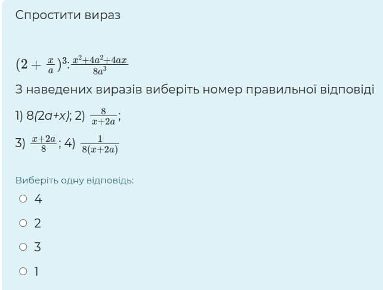

# Булевий тип даних та керівні структури з оператором циклу **while**

## if elif else конструкция
### задание
Допишите код так, чтобы меняя значение переменной day_of_week выводились следующие сообщения
ʼрабочий деньʼ, 'выходной', 'Ошибка! Дни недели считаются 1-7 ни больше ни меньше!'
```python
day_of_week = 5
# ваш код с условиями
```

###задание
У вас есть переменные holiday, day_of_week, wallet проставьте условия в код. попробуйте менять исходные значения чтоб убедиться что все 
```python
holiday, day_of_week, wallet = False, 6, 5000
if ____:
    print("оно то и можно погулять но не на что")
elif _____:
    print("пиво и чипсы на большее денег нет")
elif _____:
    print("гуляем в ресторане, всех угощаю")
elif ____:
    print("После Безоса следующим лечу я. И моя любимая кошка!")
else:
    print("работаем")
```

###задание
Выведите значения у для х в пределах от 0 до 100 c шагом 1 если y = 3x + 12
```python
x = 0
# ваш код

```

### задание
Провалидируйте введенный пользователем номер телефона. 
- начинается с +3
- код оператора один из 050 067 099 063 
- длинна правильная
попробуйте менять значение номера чтоб убедиться что ваши условия отрабатывают правильно.
```python
phone = '+321123456123'
# ваш код
```


### задание
Используя функцию input получаем от пользователя **строку**. 
Напишите код в котором просим дать ответ на загадку. Если человек сдается он вводит q или Q и прерываем цикл while.
Если угадал - выводим поздравление. Если нет - пристыдите его.
_Ответ принимается регистронезависимо._
```python
question = 'Маленькое беленькое на потолко висит не светит'
answer = 'лампачка'
#todo: ваш код с циклом и условием выхода


```

### задание
Наверняка вам доводилось связываться с оператором мобильной связи. С помощью вложенных if и чувства меры опишите систему где ответ человека принимается через input и дальшейшее общение продолжается в новом "ключе"
Сделайте возможным из любого места нажать q и прервать мучения пользователя.

Например: 
```
-> здравствуй, если хочешь узнать акции нажми 1, если тариф 2, если погоду 3
<- 2
->  узнать свой тариф 1, новые тарифы 2, остаток по счету 3
<- 3
->  остаток по основному счету 1 остаток по бонусному 2
<- 1
->  остаток в гривнах 1 остаток в минутах/гигабайтах 2
<- 1
->  на вашем счету 5 грн
```
(стрелочки это направление вывод или ввод данных. В консоли они не выводятся)


### Задание "Невсеремось!"
Каждый родитель столкнется с ситуацией когда нужно упростить пример и выбрать правильный ответ. Возможно вы хорошо помните а возможно сделаете предположение,
что если уравнение А упрощается до уравнения Б то при одинаковых значениях переменных `х` и `а` будет одинаковый результат. Таким образом используя циклы можно легко не решая найти правильный ответ.
Вот вам пример 